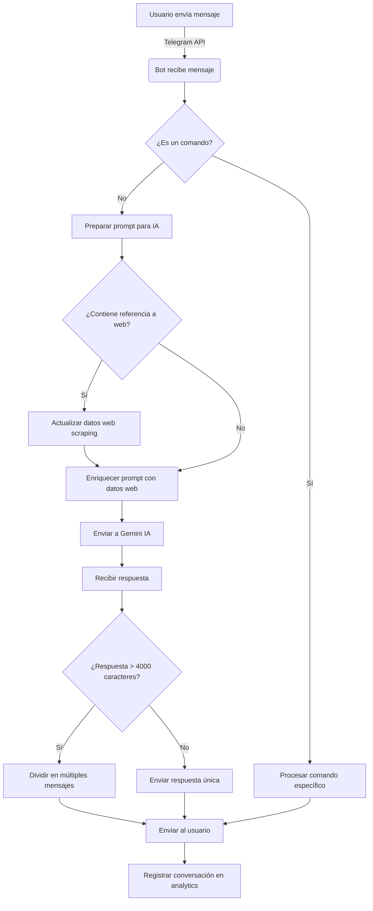

# 📊 Guía Visual - Chatbot INGE LEAN S.A.S.

<div align="center">
  
  <h3>Asistente Virtual Inteligente con Análisis Avanzado</h3>
  <p><em>Hackaton 2025 - Talento Tech</em></p>
</div>

## 🧩 Arquitectura del Sistema

```
┌───────────────────┐      ┌───────────────────┐      ┌───────────────────┐
│                   │      │                   │      │                   │
│  Cliente Telegram ├─────►│  Servidor Express ├─────►│   API Gemini IA   │
│                   │      │                   │      │                   │
└───────────────────┘      └─────────┬─────────┘      └───────────────────┘
                                     │
                           ┌─────────▼─────────┐
                           │                   │
                           │  Web Scraper      │───► ingelean.com
                           │                   │
                           └─────────┬─────────┘
                                     │
                           ┌─────────▼─────────┐      ┌───────────────────┐
                           │                   │      │                   │
                           │  Módulo Analytics ├─────►│    Dashboard      │
                           │                   │      │                   │
                           └───────────────────┘      └───────────────────┘
```

## 🔍 Flujo de Procesamiento de Mensajes



## 📱 Interfaz de Telegram

### Comandos Disponibles

| Comando | Descripción | Ejemplo de Respuesta |
|---------|-------------|----------------------|
| `/start` | Inicia conversación | ¡Hola! 👋 Soy el asistente virtual de INGE LEAN S.A.S... |
| `/servicios` | Muestra servicios | 🛠️ **Servicios de INGE LEAN:**<br>• Desarrollo de software a medida<br>• Automatización industrial<br>... |
| `/proyectos` | Muestra proyectos | 💼 **Proyectos de INGE LEAN:**<br>• Domótica<br>• Máquina dosificadora<br>... |
| `/contacto` | Información de contacto | 📞 **Contacto INGE LEAN:**<br>📧 Email: contacto@ingelean.com<br>... |
| `/empresa` | Información corporativa | 🏢 **Sobre INGE LEAN S.A.S.:**<br>Empresa colombiana especializada en... |

## 📊 Dashboard de Analytics


### Principales Visualizaciones

1. **Distribución de Sentimientos**
   - Gráfico circular que muestra % de sentimientos detectados (positivo, negativo, neutral)

2. **Tendencias Temporales**
   - Gráfico de líneas mostrando actividad por hora del día

3. **KPIs Clave**
   - Total de conversaciones
   - Tiempo promedio de respuesta
   - Tasa de resolución
   - Casos escalados

4. **Temas Frecuentes**
   - Nube de palabras con temas más consultados

## 🧠 Integración con Gemini IA

### Proceso de Enriquecimiento de Prompts

1. **Prompt Base**
   ```
   Eres un chatbot inteligente de atención al cliente para INGE LEAN S.A.S...
   ```

2. **Enriquecimiento con Datos Web**
   ```
   Información actualizada del sitio web (ingelean.com):
   Descripción: INGE LEAN S.A.S. es una empresa colombiana especializada en...
   
   Servicios:
   • Desarrollo de software a medida: Soluciones personalizadas para...
   • Automatización industrial: Implementación de sistemas...
   ```

3. **Contexto de Conversación**
   ```
   Historial reciente con el usuario:
   Usuario: ¿Qué servicios ofrecen?
   Asistente: Ofrecemos desarrollo de software, automatización...
   
   Mensaje actual: "¿Tienen experiencia en domótica?"
   ```

## 🌐 Web Scraping

### Estructura de Datos Extraídos

```json
{
  "title": "INGE LEAN S.A.S. - Ingeniería y Desarrollo",
  "description": "Empresa colombiana especializada en desarrollo de software...",
  "servicios": [
    {
      "title": "Desarrollo de Software",
      "description": "Creamos soluciones digitales a medida..."
    },
    {
      "title": "Automatización Industrial",
      "description": "Optimizamos procesos productivos..."
    }
  ],
  "contacto": {
    "email": "contacto@ingelean.com",
    "telefono": "+57 300 123 4567",
    "direccion": "Pereira, Risaralda, Colombia"
  },
  "sections": {
    "nosotros": {
      "title": "Quiénes Somos",
      "content": "INGE LEAN S.A.S. es una empresa dedicada a..."
    }
  }
}
```

## 📈 Análisis de Sentimiento

### Clasificación de Emociones

| Categoría | Ejemplo de Mensajes | Palabras Clave |
|-----------|---------------------|----------------|
| **Positivo** | "Gracias por la información, excelente servicio" | gracias, excelente, perfecto, genial |
| **Negativo** | "Esto no funciona, estoy frustrado" | problema, error, mal, terrible, horrible |
| **Urgente** | "Necesito solución inmediata" | urgente, inmediatamente, ya, ahora mismo |
| **Escalación** | "Quiero hablar con un supervisor" | supervisor, gerente, hablar con alguien |

## 🔧 Configuración y Despliegue

### Variables de Entorno (.env)

```
PORT=3000                           # Puerto del servidor Express
TELEGRAM_BOT_TOKEN=123456:ABC-DEF   # Token de Telegram (de BotFather)
GEMINI_API_KEY=AIzaSyA...           # API Key de Google Gemini
API_SECRET_TOKEN=secreto123         # Token para endpoints protegidos
```

### Comandos de Ejecución

```bash
# Instalación
npm install

# Ejecución de desarrollo
npm run dev

# Ejecución con nodemon (auto-reinicio)
npm run dev-watch
```

## 🔒 Seguridad Implementada

### Rate Limiting

```javascript
const limiter = rateLimit({
  windowMs: 1 * 60 * 1000,  // 1 minuto
  max: 100,                 // máximo 100 peticiones por minuto
  message: 'Demasiadas solicitudes. Intenta más tarde.',
});
app.use(limiter);
```

### Autenticación de API

```javascript
function authMiddleware(req, res, next) {
  const token = req.headers.authorization?.split(' ')[1];
  if (!token || token !== process.env.API_SECRET_TOKEN) {
    return res.status(401).json({ error: 'No autorizado' });
  }
  next();
}
```

---

<div align="center">
  <p>Desarrollado para Hackaton Talento Tech 2025</p>
  <p>© 2025 - INGE LEAN S.A.S. - Todos los derechos reservados</p>
</div>
